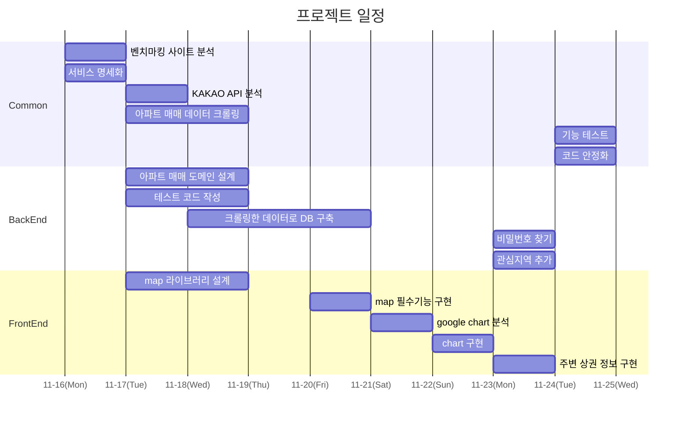

## 개발 인원
2명

## 개발 기간
22.11.16 ~ 22.11.24

```mermaid
 gantt
  dateFormat  MM-DD
  axisFormat  %m-%d(%a)

  title  프로젝트 일정
  section Common
  벤치마킹 사이트 분석 :w1-1, 11-16, 1d
  서비스 명세화 :w1-2, 11-16, 1d
  KAKAO API 분석 :w1-3, after w1-2, 1d
  아파트 매매 데이터 크롤링 : w1-4, after w1-2, 2d
  기능 테스트 :w1-5, 11-24, 1d
  코드 안정화 :w1-6, 11-24, 1d
  
  section BackEnd
  아파트 매매 도메인 설계 :w2-1, 11-17, 2d
  테스트 코드 작성 :w2-2, 11-17, 2d
  크롤링한 데이터로 DB 구축 : w2-3, 11-18, 3d
  비밀번호 찾기 :w2-4, 11-23, 1d
  관심지역 추가 :w2-5, 11-23, 1d 

  section FrontEnd
  map 라이브러리 설계 :w3-1, 11-17, 2d
  map 필수기능 구현 :w3-2, 11-20, 1d
  google chart 분석 :w3-3, 11-21, 1d
  chart 구현 :w3-4, 11-22, 1d
  주변 상권 정보 구현 :w3-5, 11-23, 1d
  
```

